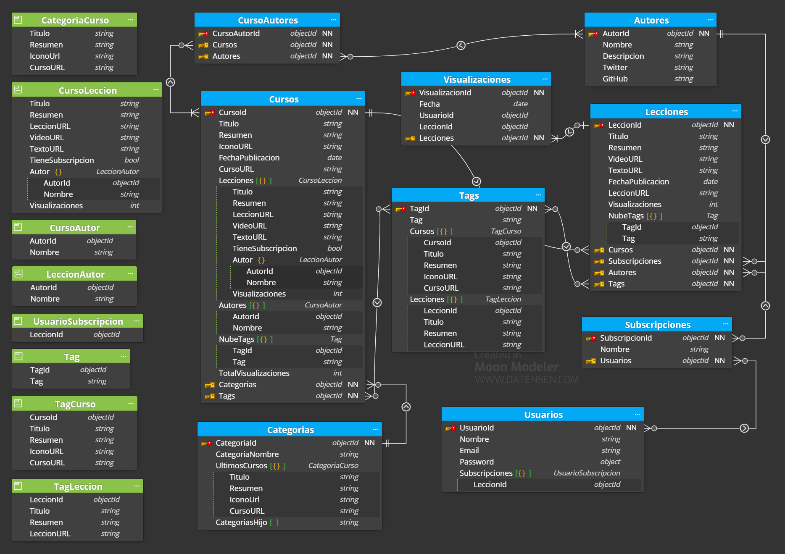

# Bootcamp Backend - Laboratorio Modelado MongoDB

Este respositorio contiene todo el material correspondiente a la entrega del laboratorio sobre modelado en MongoDB.

En la carpeta Modelado se incluye:
- Archivo del diagrama del modelo de datos realizado con la aplicación Moon Modeler. [Archivo](./Modelado/DiagramaModelado.dmn)
- Imagen del diagrama

## Explicación patrones:

- En la página Home se van a cargar los últimos 5 cursos de cada catergoría, por lo que para mejorar el rendimiento (aunque luego vaya a estar cacheada en el servidor), incluyo un array con los últimos cursos.

- Como la página de un curso se va a consultar con frecuencia, incluyo en la colección un array con los datos necesarios de las lecciones, así como los nombres de los autores. Este es el patrón **extended ref**.

- La página de una lección también se va a consultar frecuentemente y como contiene el listado de lecciones del curso y la navegación anterior va a ser desde la página del curso, lo mejor es incluir los atributos de Lecciones necesarios directamente en Cursos.

- Se quiere mostrar también el autor de un vídeo, por lo que añado el nombre del autor a los datos de lección guardados en la colección de Cursos.

- Para la jerarquía de categorias, no se indica como va a ser la navegación, por lo que he deducido que simepre se va a navegar desde el padre al hijo. He aplicado **tree pattern** usando *child reference*.

- He añadido un campo para indicar si una lección requiere subscripción o no en la colección de Cursos y así saber si se tiene que comprobar si la lección está en a lista de subscripciones del usuario.

- El uso de tags implica que la búsqueda sea rápida, incluyo un listado de tags a nivel de curso y lección, pero también en cada tag indico el listado de cursos y lecciones.

- Usando **computed pattern** añado un campo calculado de cada lección y curso. El valor se calculará cadá 30 minutos y así tener un valor estimado.

## Backup

Para la parte opcional de entrega un backup de una base de datos de ejemplo he realizado los siguientes pasos:
1. Crear base de datos lemoncode-tv y colección cursos.
2. Crear colección autores.
3. Añadir datos a la colección autores.
4. Install MongoDB Database Tools.
5. Backup de la base de datos con el comando *mongodump --db lemoncode-tv*
